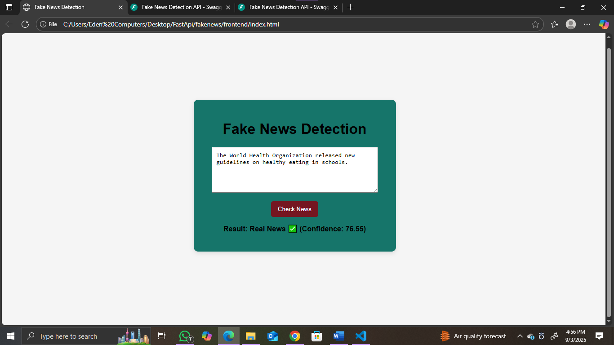
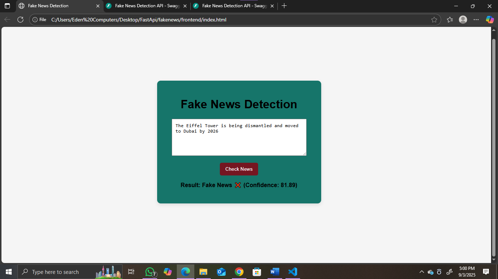

## 📰 Fake-News-Detection-API
- A machine learning-based web application to detect Fake vs Real News using a trained classification model. Accuracy is low it is my just practice using Fast API  .The backend is built with FastAPI, while the frontend is a simple HTML/JS interface. 
---

##  Features
- Detects whether a news text is **Real ✅** or **Fake ❌**  
- Provides a **confidence score (%)** for predictions  
- REST API built with **FastAPI**  
- Interactive API docs using **Swagger** (`/docs`) and **ReDoc** (`/redoc`)  
- Frontend built with **HTML, CSS, JavaScript**  
- CORS enabled for easy frontend-backend communication  

---
## Screenshots

|  **Predictions** 
|-----------|
|  
| 
|  

---
## ⚙️ Installation & Setup

```bash
git clone https://github.com/your-username/fakenews-detection.git
cd fakenews
2️⃣ Create a virtual environment & activate
python -m venv venv
venv\Scripts\activate    # On Windows
source venv/bin/activate # On Linux/Mac

3️⃣ Install dependencies
pip install -r requirements.txt

4️⃣ Run FastAPI server
uvicorn backend.app:app --reload
